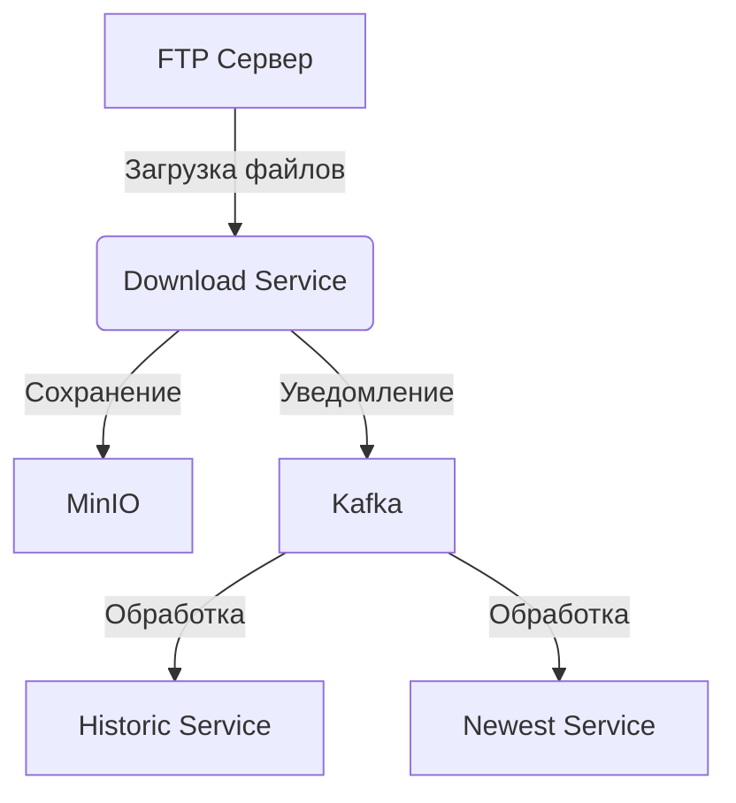

# NodehistJ - Загрузка списков узлов

Модуль для автоматической загрузки файлов nodelist с FTP сервера (порт 8080)

## Архитектура системы



## Основные сервисы

1. **FTP Client** - загрузка файлов с FTP сервера
2. **MinIO Storage** - хранение загруженных файлов
3. **Kafka Producer** - отправка уведомлений о новых файлах
4. **Scheduler** - управление периодичностью загрузок

## Переменные окружения

| Переменная | Сервис | Описание |
|------------|--------|----------|
| `FTP_*` | FTP Client | Настройки подключения к FTP |
| `MINIO_*` | MinIO Storage | Настройки хранилища |
| `KAFKA_*` | Kafka Producer | Настройки брокера сообщений |

## Запуск сервисов

```bash
# Запуск всех сервисов
docker compose -f compose.yml up
```
